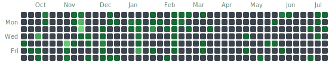

  <!-- Github logo -->
  
    
  <!-- 301 Badge -->
  
    

  <!-- Gitea's heatmap -->
  <em>Private server:</em> 
  

  <!-- New section below -->
  

   

  <!-- Blender badge -->
  

   

  <!-- Hombrew badge -->
  

    

